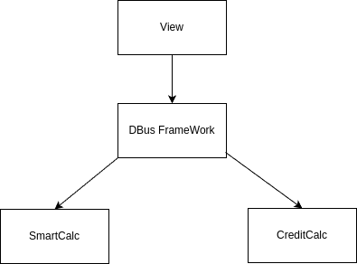

# Dbus SmartCalc

Приложение поднимает 3 сервиса и запускает пользовательский интерфейс
1. DbusFramework
2. SmartCalcModel
3. CreditCalcModel

Зависимости:
 - qt-5
 - dbus

make цели:
 - all
 - start
 - install
 - uninstall

## Contents

1. [View](#View) \
    1.1. [ViewCalc](#ViewCalc)
2. [dbusFramework](#dbusFramework) \
    2.1. [dbusFramework](#dbusFramework)
3. [model](#model) \
    3.1. [SmartCalcModel](#SmartCalcModel)  
    3.2. [CreditCalcModel](#CreditCalcModelе)  

# View

## ViewCalc

Реализация с графическим пользовательским интерфейсом, на базе QT.
Поднимает dbusframework и регестрирует 2 сервиса
Инетерфейс адаптирован по mac os. На linux может съезжать верстка.

make цели:
 - all
 - install
 - uninstall
 - dvi
 - dist
 - clean

# dbusFramework

## dbusFramework

Является маршрутизатором для отправки сообщений в зарегестрированные сервисы

make цели:
 - all
 - install
 - uninstall
 - dvi
 - dist
 - clean

# model

## SmartCalcModel

Сервис принимающий строку для вычислений и возвращающий результат

make цели:
 - all
 - install
 - uninstall
 - dvi
 - dist
 - clean
 - tests
 - gcov_report

## CreditCalcModel

Сервис "кредитный калькулятор" 

 - Вход: общая сумма кредита, срок, процентная ставка, тип (аннуитетный, дифференцированный)
 - Выход: ежемесячный платеж, переплата по кредиту, общая выплата

make цели:
 - all
 - install
 - uninstall
 - dvi
 - dist
 - clean
 - tests
 - gcov_report

